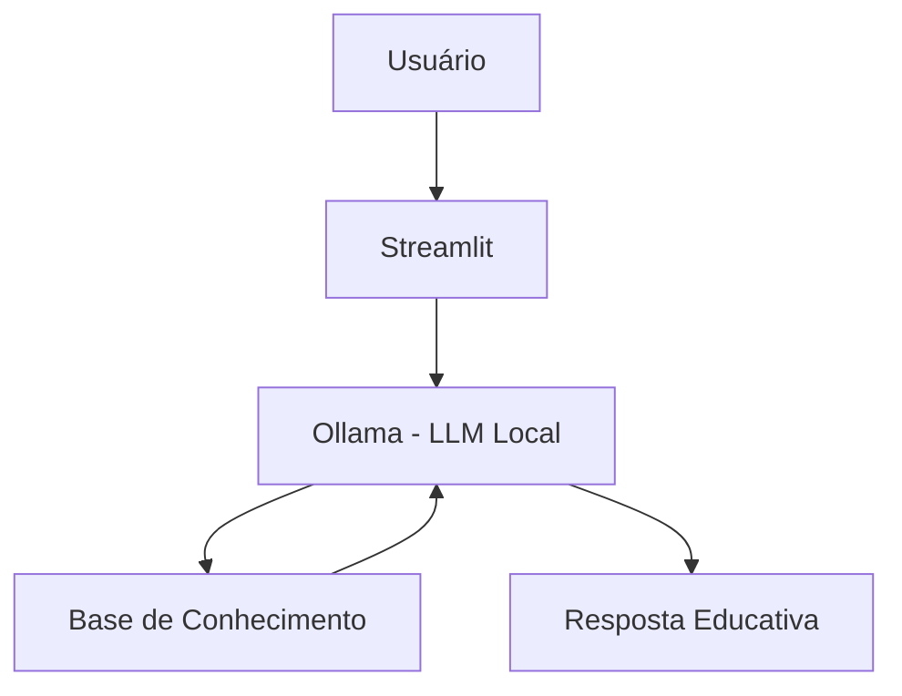

# 💰 Jay - Assistente Financeiro Inteligente

> Agente de IA Generativa que ajuda usuários a organizar suas finanças, entender seus gastos e acompanhar metas financeiras de forma simples e personalizada.

## 💡 O Que é o Jay?

O Jay é um assistente de educação e organização financeira que ensina e orienta, mas não recomenda investimentos. Ele utiliza os dados financeiros disponíveis para apresentar explicações simples e exemplos práticos.

**O que o Jay faz:**
- ✅ Explica conceitos de finanças pessoais
- ✅ Analisa gastos de forma educativa
- ✅ Acompanha metas financeiras
- ✅ Usa os dados do usuário para contextualizar respostas
- ✅ Responde dúvidas sobre produtos financeiros de forma educativa
  
**O que o Jay NÃO faz:**
- ❌ Não recomenda investimentos específicos
- ❌ Não promete rentabilidade
- ❌ Não acessa senhas ou dados bancários sensíveis
- ❌ Não substitui um profissional financeiro certificado

## 🏗️ Arquitetura



**Stack:**
- Interface: Streamlit
- LLM: Ollama (modelo local `gpt-oss`)
- Linguagem: Python
- Dados: JSON/CSV mockados

## 📁 Estrutura do Projeto

```
├── data/                          # Base de conhecimento
│   ├── perfil_investidor.json     # Perfil do cliente
│   ├── transacoes.csv             # Histórico financeiro
│   ├── historico_atendimento.csv  # Interações anteriores
│   ├── produtos_financeiros.json  # Produtos para ensino
    └── meta_financeira.json       # Meta do cliente
│
├── docs/                          # Documentação completa
│   ├── 01-documentacao-agente.md  # Caso de uso e persona
│   ├── 02-base-conhecimento.md    # Estratégia de dados
│   ├── 03-prompts.md              # System prompt e exemplos
│   ├── 04-metricas.md             # Avaliação de qualidade
│   └── 05-pitch.md                # Apresentação do projeto
│
└── src/
    └── app.py                     # Aplicação Streamlit
```

## 🚀 Como Executar

### 1. Instalar Ollama

```bash
# Baixar em: ollama.com
ollama pull gpt-oss
ollama serve
```

### 2. Instalar Dependências

```bash
pip install streamlit pandas requests
```

### 3. Rodar o Jay

```bash
streamlit run src/app.py
```

## 🎯 Exemplo de Uso

**Pergunta:** "Quanto gastei com alimentação?"
**Jay:** "Pelos dados disponíveis, você gastou R$ 570,00 com alimentação. Esse valor considera as transações registradas nessa categoria."

**Pergunta:** "Como está minha meta de viagem?"
**Jay:** "Sua meta é de R$ 3.000,00 e você já alcançou R$ 1.200,00. Isso representa 40% da sua meta. Ainda faltam R$ 1.800,00."

**Pergunta:** "Qual investimento você recomenda?"
**Jay:** "Eu posso explicar como diferentes investimentos funcionam, mas não posso recomendar um investimento específico. Posso te ajudar a entender os conceitos e características dos produtos financeiros."

## 📊 Métricas de Avaliação

| Métrica | Objetivo |
|---------|----------|
| **Assertividade** | O agente responde o que foi perguntado? |
| **Segurança** | Evita inventar informações (anti-alucinação)? |
| **Coerência** | A resposta é adequada ao perfil do cliente? |

## 🎬 Diferenciais

- **Personalização:** Utiliza os dados do usuário para contextualizar as respostas
- **100% Local:** Roda com Ollama, sem enviar dados para APIs externas
- **Educativo:** O foco é ensinar e ajudar na organização financeira
- **Metas:** Permite acompanhar o progresso dos objetivos financeiros
- **Seguro:** Possui regras para evitar alucinações e recomendações de investimentos

